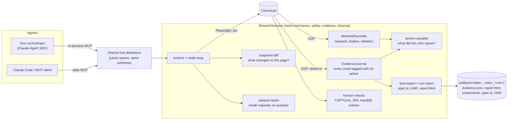
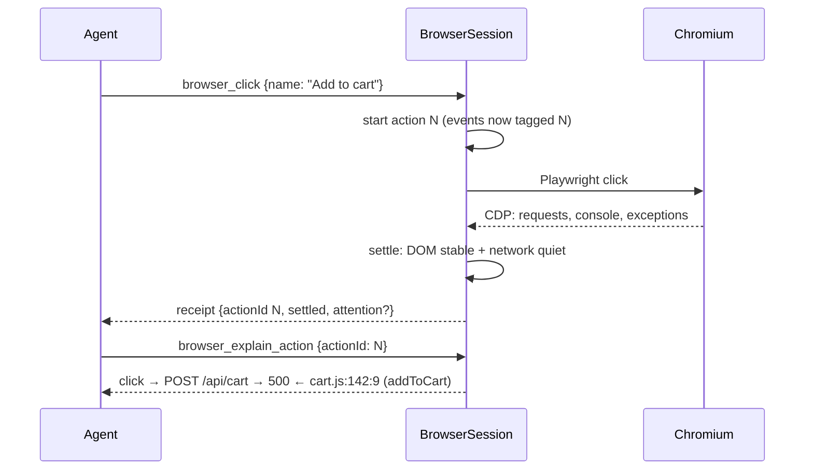

# Agent Browser Runtime

Agent Browser Runtime gives an AI agent a real Chromium browser through the
[Model Context Protocol](https://modelcontextprotocol.io). The agent reads the page's
accessibility tree, decides what to do next, and acts. The runtime handles the browser
mechanics: launching Chromium, waiting for the page to settle, capturing network and console
evidence through the Chrome DevTools Protocol (CDP), screenshots, and cleanup.

- **Chromium is included.** The package downloads a pinned Chromium build into its own
  `.browsers/` directory when you install it. There is no separate `playwright install` step.
- **MCP server and library.** Use it as a stdio MCP server (Claude Code, Claude Desktop, Cursor,
  or any MCP client), in-process with the Claude Agent SDK, or directly from TypeScript.
- **Evidence, not only actions.** Every action returns a bookmark. Ask for the network responses,
  response bodies, console messages, page errors, and CDP events captured after that bookmark.

Overview page: [amankulkarni29.github.io/agent-browser-runtime](https://amankulkarni29.github.io/agent-browser-runtime/) (why it exists, how it works, use cases, results).

## How it works



The agent owns the plan and the verdict. `BrowserSession` owns browser mechanics. One tool call:



## Architecture
### External seam

`BrowserSession` is the deep module. Its exploratory interface follows an observe, decide,
act loop:

```typescript
navigate(url)
login(target)
snapshot()
click(target)
type(target, value)
press(key)
hover(target)
dismissOverlay()
waitForSettled()
verify(condition, timeoutMs?)
sequence(steps, timeoutMs?)
screenshot(name?)
requests(query?)
request(id)
responseBody(id, offset?, limit?)
frames()
inspect(target, properties?)
viewport(width, height)
evidence(query?)
getEvidence(query?)
explainAction(actionId?, filter?)
changes()
addFault(rule) / clearFaults()
requestHandoff(reason, timeoutMs?)
report(input)
exportTest(name)
cdp(method, params?) / cdpWait(event, timeoutMs?)   // only with isRawCdpEnabled
close()
```

The caller supplies an initial website URL and an investigation goal. It reads the real
accessibility tree and decides each next action. It does not need to predict the page structure,
route, or visible text before navigation.

The session hides the bundled Chromium, launch flags, desktop browser identity, pages, locators,
automatic waiting, CDP sessions, response-body capture, redaction, screenshots, traces, and
cleanup.

`login(target)` extends this same ownership to credential entry: `BrowserSession` resolves a
trusted account profile, drives the login form, and confirms an authenticated-session signal.
Adapters forward `{ profile, brand, environment, controls? }`. The optional controls are
current DOM references discovered by the agent through inspection. The runtime checks that
they are visible fields and a submit control in the same form, on an exact approved credential
origin (HTTPS or loopback), with an approved form destination. Only then does it retrieve and enter credentials.
The owner supplies trusted origins and an authenticated-session signal through
`loginBrandConfigs`/`accountCredentialProvider`. Existing configured-control callers remain supported. See
the README's "Login for post-login QA" section for the caller contract.

`login-verification` owns bounded pre-submit readiness for visible native verification checkboxes
in a trusted provider frame. It uses read-only CDP to inspect closed shadow roots, checks the
checkbox and embedding frame hit targets, and activates at most once through normal Playwright
pointer input. `BrowserSession` rechecks the credential origin, discovered form controls, and
session epoch around that wait. A verification click does not establish an authenticated session; the
configured success signal remains authoritative.

### Internal shape

```text
MCP client ─── stdio MCP adapter ──┐
                                   ├── BrowserSession
Your agent ── Agent SDK adapter ───┘      ├── Playwright: actions and accessibility
                                          ├── settle loop: DOM stability + network quiet
                                          ├── CDP: failures, exceptions, logs, audits
                                          ├── EvidenceJournal: bookmarks and redaction
                                          ├── NetworkRecorder: bounded request/body lookup
                                          ├── action-causality: action → request → message tree
                                          ├── snapshot-diff: accessibility tree changes
                                          ├── network-faults: injected failures, delays, rewrites
                                          ├── human-checks + challenge-monitor/notifier: challenges and handoff
                                          ├── test-export: Playwright spec and HAR
                                          ├── run-report: report.html
                                          ├── ElementInspector: DOM identity, styles and CSS source rules
                                          ├── evidence.json: bounded durable run manifest
                                          └── artifacts: screenshots and trace
```

Both adapters expose the same model-facing tool names. Tests call `BrowserSession` directly and
also connect through both MCP adapters, so callers and tests cross the same seam.

### Ownership and completion

The browser module does not own an investigation plan or verdict. The caller supplies only the
website URL and goal. The agent explores the site and returns its findings. The orchestrator
decides whether the run completed and can salvage `session.getEvidence()` if the agent times out.

This split means the caller never has to invent selectors or page text in advance.

Verified actions use this same division of responsibility. The investigator supplies
an observed target and an expected condition. `verify` checks that condition without
performing a page action. `sequence` executes a validated list of up to ten ordinary actions
and checks with one deadline. It stops on the first failure and returns partial
progress and evidence. It does not retry, branch, or infer a test result. An action without a postcondition is completed, not verified.
Both adapters share the schemas and definitions in `action-tools`; browser mechanics
and the session lifetime remain in the core.

### Session lifecycle

`BrowserSession` delegates launch ownership to the core browser launcher.
Chromium is bundled: it is downloaded into `<package>/.browsers` at install time, and
`bundled-browser` points Playwright there before Playwright loads. A missing executable is
downloaded once on first launch. The optional virtual-display launcher uses a per-session
supervisor to own Chromium, Xvfb, a private temporary profile and the local CDP endpoint. Its IPC connection
ties those resources to the caller's lifetime, including unexpected caller death.
The adapter does not implement launch mechanics. `BrowserSession` retains the
same action, credential and evidence boundaries in either mode.

Chromium starts lazily on the first navigation. The first URL establishes the first-party domain
used to classify evidence. There is no navigation allowlist and no irreversible-action guard: the
agent may open any URL and click any control. `close()` saves `trace.zip` only when tracing is enabled, releases browser
and CDP resources, clears the run state, and leaves the same `BrowserSession` ready for another
investigation. Tracing is disabled by default because traces are large and can contain sensitive
browser data.

Each action returns an evidence bookmark. Every journal event and captured request also records the
ID of the most recent action started before it, and a failed action keeps its own ID.
`explainAction` builds a cause-and-effect tree from those records with the pure
`action-causality` module. It reads the CDP request initiator and console and exception stacks;
`Runtime.setAsyncCallStackDepth` makes those stacks cross timers and promises. Links between a
message and a request are inferred from shared stack frames and are labeled as inferred. `evidence({ since: bookmark })` returns only the signal
captured after that point. `getEvidence()` returns the already-captured signal synchronously for
abort and timeout recovery. The journal and each model-facing evidence category are capped, so a
long investigation cannot grow process memory or an MCP response without limit.
The journal reserves a quarter of its bounded capacity for recent action, login,
verification and sequence outcomes. Noisy network events use the remaining capacity
and any spare outcome capacity. Retained events keep their original sequence numbers
and chronological order. The model-facing `outcomes` category has its own 100-event
limit; capture loss and truncation remain explicit.

The optional bot-bypass header is injected only for first-party requests; it is never sent to
third-party resources. The Vercel bypass secret is sent only on the bootstrap request to an
exact approved host.

### Why Playwright plus CDP

Playwright owns interaction. Its locators re-resolve after DOM changes, and its actions wait for
visibility, stability, and event reception. The session adds a post-action settle loop because
`DOMContentLoaded` does not mean an application has finished rendering.

CDP owns low-level observation: failed loads, console calls, uncaught exceptions, browser logs,
lifecycle events, audits, frames, and targets. NetworkRecorder retrieves bounded CDP response bodies, including successful API responses whose
empty or unexpected body may be the defect. Playwright listeners supplement console and page errors.

Raw CDP commands are not part of the external interface. NetworkRecorder and ElementInspector
remain internal mechanics owned by BrowserSession. Both adapters use the same inspection-tool
definitions. The manifest preserves run/action/request/event IDs; adapters preserve those IDs.
The orchestrator publishes artifact links and owns the verdict.

## Quick start

Requirements: Node.js 22 or later and pnpm (`corepack enable`).

```bash
git clone <this-repo> agent-browser-runtime
cd agent-browser-runtime
pnpm install        # also downloads Chromium into .browsers/
pnpm build
node dist/cli.js doctor
```

`doctor` launches the bundled Chromium and prints its version and path. To see the MCP server
work end to end, run the demo. It starts the server as an MCP client would, serves a local page,
and drives it through the tools:

```bash
node examples/demo.mjs            # local page only
node examples/demo.mjs --public   # also visits example.com and follows a cross-host link
```

## Use it as an MCP server

### Claude Code

```bash
claude mcp add agent-browser -- node "$(pwd)/dist/adapters/mcp-server.js"
```

Then ask Claude something like:

> Open https://news.ycombinator.com, find the top story, open it, and tell me whether the page
> logged any console errors or failed requests.

### Claude Desktop, Cursor, and other MCP clients

Print a config block with absolute paths for this checkout:

```bash
node dist/cli.js mcp-config
```

It produces a block like this. Paste it into your client's MCP configuration:

```json
{
  "mcpServers": {
    "agent-browser": {
      "command": "/path/to/node",
      "args": ["/path/to/agent-browser-runtime/dist/adapters/mcp-server.js"],
      "env": { "BROWSER_TRACE": "0" }
    }
  }
}
```


## Tools

| Tool | What it does |
| --- | --- |
| `browser_navigate` | Open a URL and wait for the page to settle. |
| `browser_snapshot` | Return the URL, title, and accessibility tree. |
| `browser_click` | Click by accessible name and optional ARIA role, or by an inspected element ref. |
| `browser_type` | Fill a unique visible field by label, accessible name, placeholder, or element ref. |
| `browser_press` | Press a key such as `Enter`, `Escape`, or `Tab`. |
| `browser_hover` | Hover by accessible name and optional ARIA role. |
| `browser_dismiss_overlay` | Dismiss cookie banners, modals, and chat widgets, including in child frames. |
| `browser_wait_for_settled` | Wait for a stable DOM and quiet network. |
| `browser_verify` | Wait for a URL, element count or state, text, or input value without changing the page. |
| `browser_sequence` | Run up to ten actions and checks within one deadline. Stops at the first failure. |
| `browser_evidence` | Return network responses, console messages, page errors, and important CDP events. |
| `browser_report` | Write `report.html` into the run folder: the agent's goal, summary, findings, and draft GitHub issue, plus the action timeline and screenshots. |
| `browser_explain_action` | Explain what one action caused: requests with the script line that started them, console messages, exceptions, and navigations, as a tree. |
| `browser_changes` | Describe what changed in the accessibility tree since the last snapshot: added, removed, and changed nodes. |
| `browser_fault` | Make matching requests fail, return a status, slow down, or return rewritten JSON. Evidence marks injected responses. |
| `browser_faults_clear` | Remove all network faults. |
| `browser_request_handoff` | Pause for a person in the visible browser (challenge, two-factor, risky step) until they click Done. |
| `browser_export_test` | Export the session as a Playwright `.spec.ts` with a HAR of recorded responses. |
| `browser_requests` | List captured requests, filtered by URL, status, or time. |
| `browser_request` | Inspect one request: safe headers, payload, timing, initiator, and failure. |
| `browser_response_body` | Page through a captured response body by request ID. |
| `browser_frames` | List frames and their IDs. |
| `browser_inspect` | Inspect an element's DOM, geometry, computed and pseudo styles, and matching CSS rules. Returns a stable ref. |
| `browser_viewport` | Resize the viewport for responsive checks. |
| `browser_screenshot` | Capture the viewport, the full page, or one element. |
| `browser_login` | Sign in with a configured account without exposing credentials to the model. |
| `browser_close` | Save an enabled trace, close Chromium, and reset the session. |

### Action causality

`browser_explain_action { actionId? }` answers "what did this click cause?" for the latest action
or the `actionId` from a receipt:

```text
click button "Buy" (action 2) → /, settled after 516 ms
 └─ POST /api/cart → 200 [request-4]
     │ started by cart.js:2:3 (addToCart) ← setTimeout ← cart.js:10:26 (onBuyClick)
     │ body {"items":[]}
     └─ console.error "Cart is empty" at cart.js:7:43 (showCart) ← Promise.then ← cart.js:4:6 (addToCart)
```

Each request, console message, exception, and navigation belongs to the most recent action that
started before it. Request locations come from the CDP initiator, and async stack tracking follows
timers and promises back to the handler. A request is nested under the document or script that
started it. A message is nested under the request whose starting frames it shares; this link is
inferred and the result says so. `filter: "all"` also lists successful static and third-party
requests, and `format: "json"` adds the structured tree.

Typing by name ignores hidden matches and rejects multiple visible matches instead of choosing
the first one. Inspect an ambiguous field and pass its ref.

### Verified actions

`browser_verify` checks one condition. It never clicks, types, or navigates. `browser_sequence`
runs short, known interactions. Add `expect` to a step to verify its result:

```json
{
  "steps": [
    { "kind": "type", "target": { "kind": "label", "label": "Email" }, "value": "ada@example.com" },
    {
      "kind": "click",
      "target": { "kind": "role", "role": "button", "name": "Subscribe" },
      "expect": { "kind": "text", "target": { "kind": "selector", "selector": "#status" }, "equals": "Subscribed" }
    }
  ]
}
```

A step with `expect` reports `verified`. A step without it reports `completed`. The sequence
stops at the first failure and returns the partial progress and evidence. It never retries.

## Configuration

Set these variables in the MCP server's `env`. Boolean variables use `0` or `1`.

| Variable | Default | Purpose |
| --- | --- | --- |
| `HEADED` | `0` | `1` shows the Chromium window. |
| `BROWSER_LAUNCH_MODE` | unset | `virtual-display` runs full Chromium on a private Xvfb display (Linux) or a native window (macOS). `headless` forces headless mode. Do not combine with `HEADED`. |
| `BROWSER_RAW_CDP` | `0` | `1` adds `browser_cdp` and `browser_cdp_wait` (advanced raw CDP; lifecycle methods are blocked). |
| `BROWSER_CHALLENGE_NOTIFY` | `mcp` | Where challenge and handoff notices go: `mcp`, `desktop`, `webhook` (comma-separated). |
| `BROWSER_CHALLENGE_WEBHOOK_URL` | none | HTTPS URL (Slack or Teams incoming webhook, or your own) for `webhook`. |
| `BROWSER_HANDOFF_PATTERNS` | none | Extra visible-text patterns that need a person, comma-separated. |
| `BROWSER_ARTIFACTS_DIR` | `artifacts` | Directory for run folders. Each run gets `<date>_<time>_<host>_<run-id-prefix>/` with screenshots, `evidence.json`, `report.html`, and traces. |
| `BROWSER_TRACE` | `0` | `1` records a Playwright trace. Traces are large and can contain sensitive data. |
| `BROWSER_FIRST_PARTY_HOSTS` | first page's domain | Comma-separated hosts (and their subdomains) that count as first-party. See below. |
| `BROWSER_BYPASS_HEADER_NAME` | `x-agent-browser-bypass` | Header name for a bot-protection bypass token. |
| `BROWSER_BYPASS_HEADER_TOKEN` | empty | Bypass token. Sent only to first-party requests. |
| `BROWSER_VERCEL_BYPASS_SECRET` | empty | Vercel Protection Bypass for Automation secret. Requires `BROWSER_VERCEL_BYPASS_HOSTS`. |
| `BROWSER_VERCEL_BYPASS_HOSTS` | empty | Exact hostnames that receive the Vercel secret. |
| `BROWSER_LOGIN_CONFIG_FILE` | empty | Path to a private login configuration. See [Login](#login). |
| `PLAYWRIGHT_BROWSERS_PATH` | `<package>/.browsers` | Use a different browser directory, for example a shared Playwright cache. |
| `AGENT_BROWSER_AUTO_INSTALL` | `1` | `0` disables the automatic Chromium download on first launch. |
| `AGENT_BROWSER_SKIP_BROWSER_DOWNLOAD` | `0` | `1` skips the Chromium download during `pnpm install`. |

### What `BROWSER_FIRST_PARTY_HOSTS` does

Every captured request is labeled `first-party` (the site under test) or `third-party`
(analytics, CDNs, ads, other sites). The label controls three things:

- **`browser_evidence` filters.** `filter: "first-party"` returns only first-party requests. The
  default `filter: "errors"` returns failed or 4xx/5xx requests, requests with a captured body,
  and all first-party requests, so third-party noise stays out.
- **The summary count** `first_party` in `browser_evidence`.
- **The bypass header.** `BROWSER_BYPASS_HEADER_TOKEN` is sent only to first-party requests, so
  your token never leaks to a third-party server.

By default, the runtime takes the host of the **first page opened** in the session and treats its
last two labels as the site: after opening `https://shop.example.com`, any `*.example.com` host
is first-party. The first page stays the reference for the whole session, so following a link to
another site marks that site's requests as third-party.

Set `BROWSER_FIRST_PARTY_HOSTS` when that default is wrong. Hosts are comma-separated, and each
one also matches its subdomains:

```json
"env": { "BROWSER_FIRST_PARTY_HOSTS": "example.com, api.example-cdn.net, example.co.uk" }
```

Typical reasons: your API or assets live on another domain; the site uses a two-part country
domain such as `example.co.uk` (the default would treat all of `co.uk` as one site); or the agent
starts on a login page on a different domain from the app.

### About the bundled Chromium

`pnpm install` runs `scripts/postinstall.mjs`, which downloads the Chromium build pinned by the
installed Playwright version into `<package>/.browsers/`. The runtime points Playwright at that
directory before Playwright loads. If the download was skipped (for example, a package manager
that blocks install scripts), the runtime downloads Chromium the first time it launches a browser.
Progress goes to stderr, so the MCP stdio channel stays clean. Run
`node dist/cli.js install-browser` to download it again.

## Use it as a library

```typescript
import { BrowserSession } from 'agent-browser-runtime';

const session = new BrowserSession({ artifactsDir: 'artifacts' });
try {
  const receipt = await session.navigate('https://example.com');
  const { aria } = await session.snapshot();
  await session.click({ kind: 'role', role: 'link', name: 'Learn more' });
  const evidence = await session.evidence({ filter: 'errors', since: receipt.evidenceSince });
  console.log(aria, evidence.summary);
} finally {
  await session.close();
}
```

With the Claude Agent SDK, expose the same tools in-process:

```typescript
import { query } from '@anthropic-ai/claude-agent-sdk';
import { BrowserSession } from 'agent-browser-runtime';
import { createAgentSdkBrowserServer, BROWSER_TOOL_NAMES } from 'agent-browser-runtime/agent-sdk';

const session = new BrowserSession();
const browser = createAgentSdkBrowserServer(session);
try {
  for await (const message of query({
    prompt: 'Open https://example.com and report any failed requests.',
    options: { mcpServers: { browser }, allowedTools: BROWSER_TOOL_NAMES },
  })) {
    // Handle messages.
  }
} finally {
  await session.close();
}
```

`session.getEvidence()` returns the evidence captured so far synchronously, so an orchestrator
can keep it if the agent times out.

## Login

`browser_login` signs in with a configured account. The model passes only a profile name, a
brand, and an environment. It never sees the credential values. The runtime fills the form,
submits it, and waits for a configured signed-in signal.

Point `BROWSER_LOGIN_CONFIG_FILE` at a private JSON file (mode `0600`, outside source control):

```json
{
  "profile": "qa-account",
  "credentials": { "email": "qa@example.com", "password": "…" },
  "brands": [
    {
      "brand": "acme",
      "environment": "staging",
      "loginUrl": "https://staging.example.com/login",
      "credentialOrigins": ["https://staging.example.com"],
      "successSignal": { "kind": "url", "pattern": "/account" },
      "invalidCredentialsSignal": { "target": { "kind": "text", "text": "Invalid email or password" } },
      "challengeSignals": [{ "target": { "kind": "text", "text": "Enter the code" }, "challengeType": "mfa" }]
    }
  ]
}
```

The agent can pass `controls` with element refs it found through `browser_inspect`. Otherwise
configure `usernameField`, `passwordField`, and `submitField` locators on the brand. The runtime
enters credentials only into a visible username and password field in the same form, on one of
the `credentialOrigins`, over HTTPS or loopback. The outcome is one of `success`,
`missing_credentials`, `invalid_credentials`, `unsupported_host` (no matching brand config),
`timeout`, or `interactive_challenge`. It never retries automatically. Credential values are
redacted from snapshots, evidence, and errors. Tracing cannot be combined with login.

SDK callers pass `loginBrandConfigs` and an `accountCredentialProvider` function to
`BrowserSession` instead of using the file.

## Development

```bash
pnpm typecheck
pnpm test
pnpm build
```

Tests start local fixture sites and drive the bundled Chromium through `BrowserSession` and
through both MCP adapters. `pnpm test:unit` runs only the unit tests.

## Security

This runtime has no navigation allowlist and no blocklist of irreversible actions. The agent can
open any URL, including `localhost` and private network addresses, and can click any control,
including purchase and delete buttons. Run it only against sites and accounts you are allowed to
automate, and give the agent tasks you are comfortable letting it complete. Run it in a container
or VM when the agent's instructions come from untrusted input.

The remaining protections guard secrets: credentials go only to configured origins, bypass
headers go only to first-party or approved hosts, and known secret values are redacted from
model-facing output.
